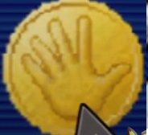
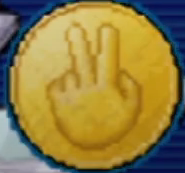

# Documentación

Este proyecto utiliza las API de geolocalización y de acceso a la cámara del navegador para mostrar información del dispositivo y activar la cámara. 

## Funciones Principales

### `showData()`

Esta función recopila y muestra información sobre el dispositivo del usuario, incluyendo:

- **User Agent:** Información sobre el navegador y sistema operativo.
- **Idioma Predeterminado:** El idioma configurado en el navegador.
- **Geolocalización:** Si la geolocalización está disponible, obtiene la posición actual y muestra la latitud, longitud y precisión.

**Uso:**

```javascript
showData();
cameraOn()
```
Esta función activa la cámara del usuario y la muestra en un elemento de video especificado en el HTML. Configura la cámara con una resolución de 840x600 píxeles.

## Uso:

cameraOn();
## Requisitos
Asegúrate de que tu navegador soporte las siguientes características:

* API de Geolocalización

* API de Media Devices

## Implementación

Asegúrate de tener un elemento con la clase info para mostrar la información y un elemento de video con el id camara.


<div class="info"></div>
<video id="camara" autoplay></video>
JavaScript
Incluye el archivo JavaScript que contiene las funciones showData y cameraOn.

<script type="module">
    import { showData, cameraOn } from './tuArchivo.js';
    
    // Llama a las funciones según lo necesites
    showData();
    cameraOn();
</script>
## Consideraciones
La geolocalización requiere el permiso del usuario y puede no estar disponible en todos los dispositivos.

El acceso a la cámara también requiere el permiso del usuario.

Este proyecto debe ejecutarse en un entorno seguro (HTTPS) para acceder a la geolocalización y la cámara.

Piedra, Papel o Tijera
Este mini proyecto es un juego interactivo de Piedra, Papel o Tijera que permite a los usuarios elegir una opción y ver el resultado de su elección en comparación con una selección aleatoria del sistema.

## Funciones Principales
-jugar(decision)
Esta función se encarga de procesar la elección del usuario y determinar el resultado del juego. Las opciones son:

Piedra (rock)

Papel (paper)

Tijeras (scissor)

La función compara la decisión del usuario con una opción aleatoria y muestra el resultado en la pantalla.

-reiniciar()
Esta función restablece el estado del juego, mostrando nuevamente todas las opciones y limpiando cualquier mensaje de resultado anterior.

## Uso
Para utilizar el juego, asegúrate de tener los siguientes elementos en tu HTML:


<div class="cover" id="rock">  </div>
<div class="cover" id="paper">  </div>
<div class="cover" id="scissor">  </div>
<button id="restart" disabled>Reiniciar</button>
<div id="result" class="none"></div>
Incluye el siguiente script en tu HTML para activar las funciones del juego:


<script type="module">
    import { jugar, reiniciar } from './tuArchivo.js';

    // Se inicializa el juego
    d.addEventListener("click", (e) => {
        if (e.target === $restart) {
            reiniciar();
        } else {
            // Lógica del juego
            jugar(decision);
        }
    });
</script>
## Consideraciones
Asegúrate de que el archivo JavaScript que contiene las funciones del juego esté correctamente vinculado en tu HTML.

Puedes personalizar las imágenes y estilos del juego según tus preferencias.

## Contribuciones
Las contribuciones son bienvenidas. Si deseas mejorar este proyecto, por favor abre un issue o envía un pull request.